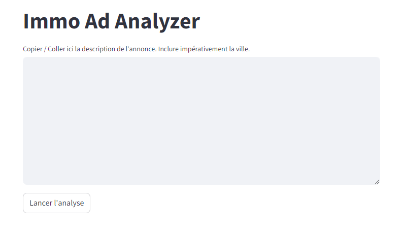
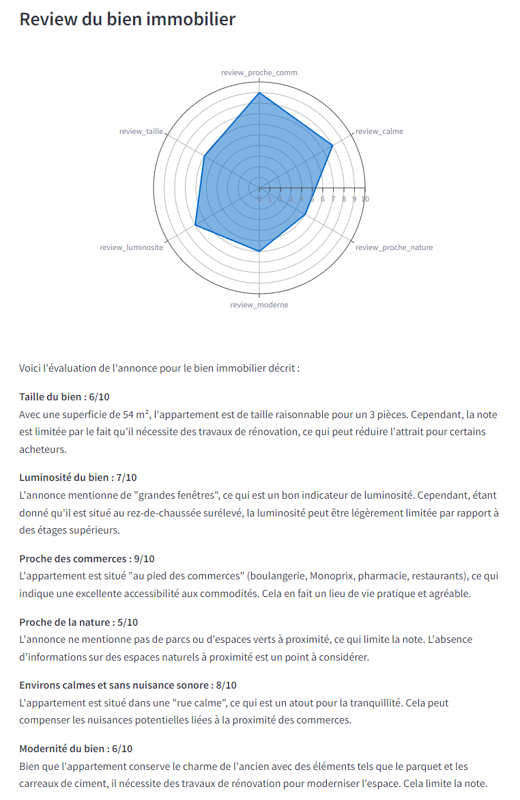

# Immo Ad Analyzer
==================

Cette application permet d'analyser la description des annonces de biens immobiliers à l'aide de LLM.

Stack : 
- Langchain
- Langsmith
- API Open AI
- Streamlit

A partir d'une annonce, l'application renvoie 3 rubriques : 

**1. Review du bien immobilier**

A l'aide d'un RAG, le modèle LLM a été entraîné à donner des notes selon un barème aux différentes caractéristiques des biens, tels qu'ils sont décrits dans l'annonce : 

**2. Coordonnées probables du bien**

Une première requête à l'API Open AI permet d'identifier les lieux mentionnés dans l'annonce.
Ces lieux font l'objet d'une requête à l'API Nominatim qui permet d'associer des coordonnées GPS aux lieux identifiés.
Une seconde requête renvoie un polygone de coordonnées GPS, correspondant à la zone probable du bien : 

**3. Réécriture de la description du bien dans un style plus ... personnel**

Un simple test de l'API Open AI.
A partir d'un prompt personnalisé, l'API renvoie une description dans un style littéraire et légèrement sarcastique : 

